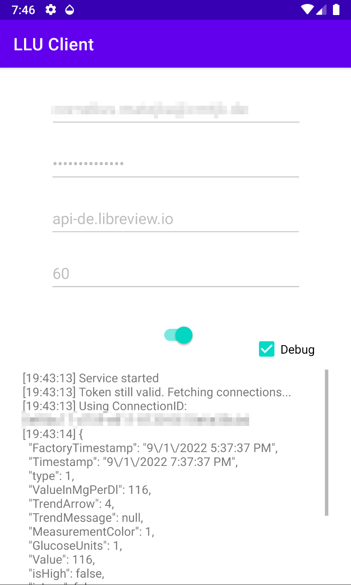

# LLU Client

Displays your current blood glucose level fetched from LibreView as notification: Status bar, lock screen, smartwatch (partially).

## Requirements
- LibreView Account (invite yourself in FreeStyle Libre app: https://www.librelinkup.com/articles/getting-started)

Note: It seems you have to install and log into the LibreLinkUp app once and accept the invitation. Otherwise no data is sent.

## How it works
The application will directly query the LibreView API every 60 (default) seconds to get current blood glucose levels. Hence it requires an internet connection every time.

The notification will show your current blood glucose level, the trend arrow, the time passed since the last measurement and its timestamp.

If the time passed is more than 5 minutes it'll show an exclamation mark.

## Why it fails
This is an very opinionated implementation with basic Android knowledge and it's only really tested on my Honor Play and Huawei Watch GT 3.

This application has bugs. Expect crashes. But I use it on a daily basis and it works sufficiently. If there's something you want to be implemented or improved create an issue, PR, fork, or contact me.

I'll not implement more sophisticated features but I'm open to increase compatibility with older and newer devices and fix bugs of course. But expect to help me with information.

If something doesn't work remember to enable debug logging. Unfortunately, it's not persistent since I debug directly in Android Studio. So If you application crashes there's not much information. Maybe I'll improve this in the future.

## Known issues
- Since the authorization token is saved for its life time you currently have to delete the application data and cache when you want to log in with another user.
- Since goes for the connection ID which is stored forever. If you change your device or maybe even if you reinstall your FreeStyle Libre app you have to delete the application data and cache and log in again.
- If you have more than one blood glucose meter only the data of the first one provided by the API is shown. This is sufficient for me since I only use the FreeStyle Libre 3 app.
- And maybe more for users with a different setup. Contact me. Maybe I can help.