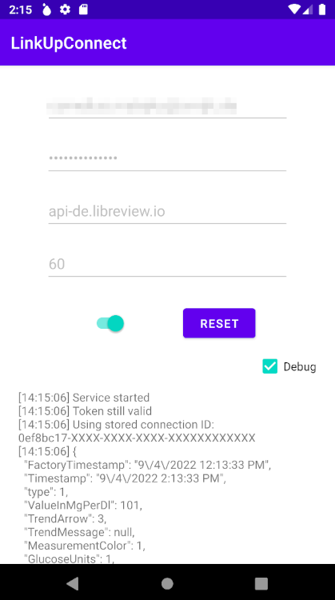
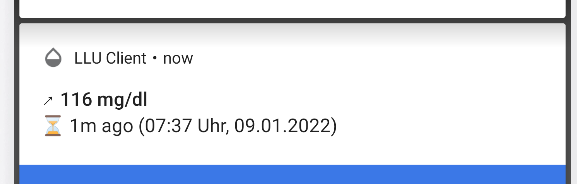
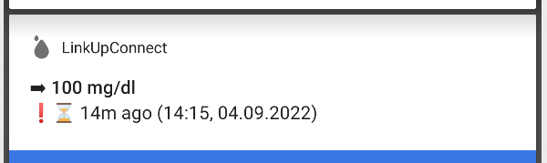
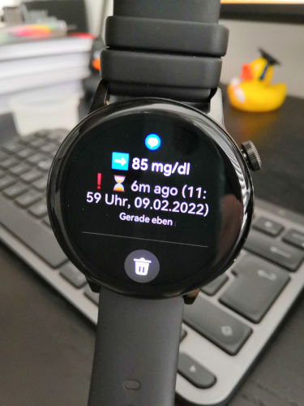
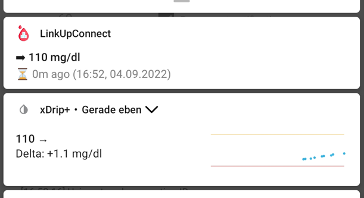

# LinkUpConnect

[Download ⬇️](https://github.com/cmtjk/LinkUpConnect/releases)

Displays your current blood glucose level fetched from LibreView as notification in status bar, lock screen, smartwatch (partially), and forward values to [xDrip+](https://jamorham.github.io/#xdrip-plus).

## Attributions
- Special thanks to [Nechoj](https://insulinclub.de/core/index.php?user/46518-nechoj/) for the inspiration
- [Diabetes icons created by Freepik - Flaticon](https://www.flaticon.com/free-icons/diabetes "diabetes icons")

## Requirements
- LibreView Account (invite yourself in FreeStyle Libre app: https://www.librelinkup.com/articles/getting-started)

Note: It seems you have to install and log into the LibreLinkUp app once and accept the invitation but you can uninstall it afterwards. Otherwise no data is sent.

## How it works
The application directly queries the LibreView API every 60 seconds (default) to get current blood glucose levels. Hence it requires an internet connection to work.

If enabled a notification will show your current blood glucose level, the trend arrow, the time passed since the last measurement and its timestamp.

If the time passed is more than 5 minutes it'll show an exclamation mark.

The notification is send to your smartwatch, too, but doesn't update. I think I can't change it because of device specific notification handling. WearOS watches might work but I don't have one.

## xDrip+
You can also enable forwarding values to [xDrip+](https://jamorham.github.io/#xdrip-plus).

Choose 'Libre2 (patched App)' as sensor because this app uses the same [mechanism](https://github.com/NightscoutFoundation/xDrip/blob/master/app/src/main/java/com/eveningoutpost/dexdrip/LibreReceiver.java#L45).

If you use xDrip+ for notifications, you can disable LinkUpConnect's notification.

## Why it sometimes doesn't work
This is an very opinionated implementation with basic Android knowledge and it's only really tested on my Honor Play and Huawei Watch GT 3.

This application has bugs. Expect crashes. But I use it on a daily basis and it works sufficiently. If there's something you want to be implemented or improved create an issue, PR, fork, or contact me.

I'll not implement more sophisticated features by now but I'm open to increase compatibility with older and newer devices and fix bugs of course. But expect to help me with information.

If something doesn't work remember to enable debug logging. Unfortunately, it's not persistent since I debug directly in Android Studio. So If you application crashes there's not much information. Maybe I'll improve this in the future.

## Known issues
- If your LibreView account is connected to more than one patient only one is shown. This is sufficient for me since I only need notifications about myself.
- When forwarding values to xDrip+ the timestamp is formatted with timezone Europe/Berlin. This will be improved in the future.
- And maybe more for users with a different setup. Contact me. Maybe I can help.